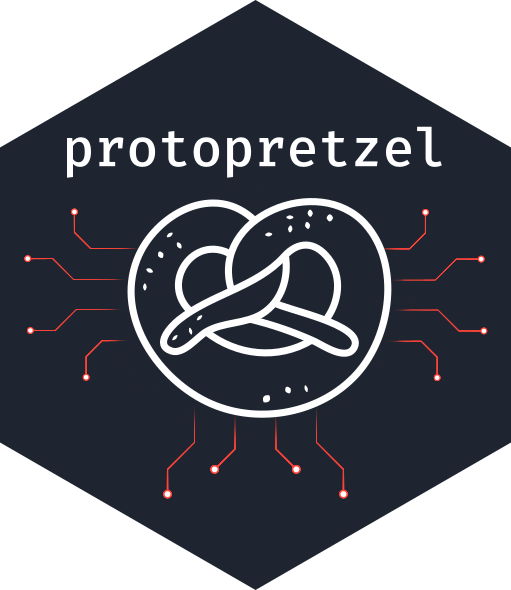

[](https://travis-ci.org/ozean12/protopretzel)
[](https://www.tidyverse.org/lifecycle/#experimental)
 [](https://opensource.org/licenses/MIT)

# protopretzel 

[Protocol Buffers](https://developers.google.com/protocol-buffers/) filter and 
serializer for [Plumber](https://www.rplumber.io/).

The **ProtoBuf filter** will unserialize ProtoBuf messages according
to the `messagetype` set in the request header
(e.g. `Content-Type: application/x-protobuf; messagetype=prototest.TestPayload`), 
and matching a `.proto` descriptor file.

The **ProtoBuf serializer** serializes an [RProtoBuf](https://github.com/eddelbuettel/rprotobuf)
message descriptor object, adding the type of message to the response header.

`protopretzel` is under active development and things may break. Check out the [protopretzel-playground](https://github.com/ozean12/protopretzel-playground) for an example implementation.


## Installation

You can install the current development version of protopretzel with:

``` r
# install.packages("devtools")
devtools::install_github("ozean12/protopretzel")
```

## Example

``` r
library(plumber)
library(protopretzel)

# Needs to be added before API creation
addProtobufSerializer()

api <- plumber$new("api.R")

addProtobufFilter(api, descriptor_path = "prototest.proto")

api$run(host = "0.0.0.0", port = 8000)
```
